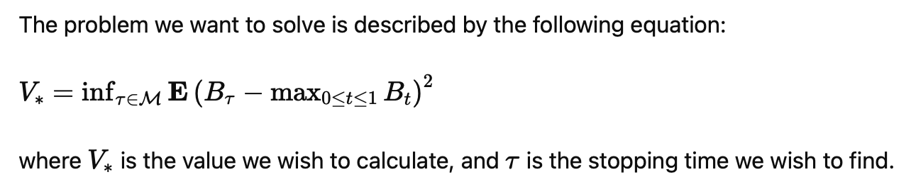

## Current Research
I am currently working on ...

## Research Experience
- **Online Optimization of Neural Network Controls for Stochastic Differential Equations** (2024)
  - **Role:** MSc student under the supervision of Prof. Justin Sirignano
  - **Description:** High-dimensional stochastic optimal control is computationally challenging. The optimal control satisfies the Hamilton-Jacobi-Bellman (HJB) equation, which is not computationally tractable to solve in high dimensions (e.g., if the SDE is more than three-dimensional). This project will implement a new online optimization method for training neural network controls for SDEs which is computationally tractable in high dimensions. The trained neural network control will be compared against alternative methods. In low dimensions (three and four dimensions), the trained neural network control will be compared against the optimal control which will be evaluated using finite-difference methods to solve the HJB partial differential equation.
  - **Technologies Used:** PyTorch, Latex
  - [Link](University_of_Oxford_Dissertation.pdf)
    
- **Optimal stopping and free-boundary problems** (2023)
  - **Role:** BSc student under the supervision of Prof. Goran Peskir
  - **Description:**

  - **Technologies Used:** Latex
  - [Link](Double_Project.pdf)
    
- **Time Series Modelling with Applications in Economics and Public Health** (2022)
  - **Role:** Independent Researcher
  - **Description:** Investigated the impacts of currency value movements on the yield and volatility of U.S. technology multinationals using data from two decades.
  - **Technologies Used:** R, Stata

## Publications
- **The Impact of Changes in Currency Value on Technology Companies’ Yield and Volatility: A Long-term Perspective** - Published 2023 [Link](https://www.researchgate.net/publication/374541926_The_Impact_of_Changes_in_Currency_Value_on_Technology_Companies'_Yield_and_Volatility_A_Long-Term_Perspective)

## Reading Notes
- **Mathematical Foudations of Reinforcement Learning** by Shiyu Zhao [Link]()
- **Mastering Reinforcement Learning with Python** by Enes Bilgin 
- **Reinforcement Learning for Adaptive Dialogue Systems** by Verena Rieser & Oliver Lemon 

